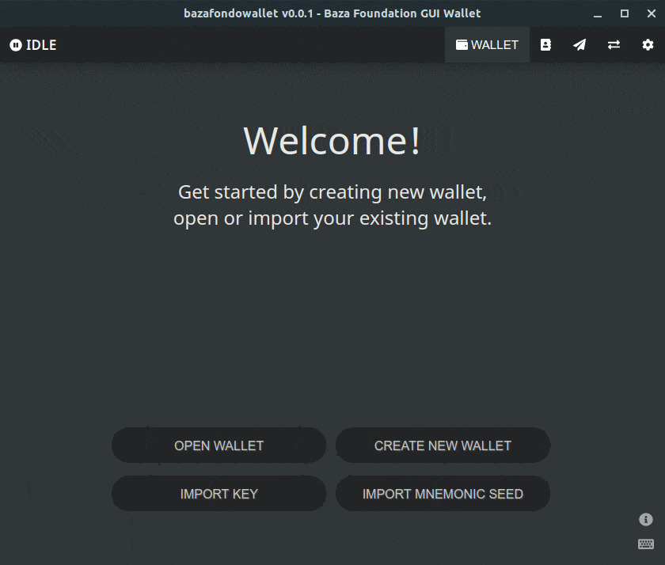

## Baza Fondo Wallet - GUI wallet for BAZ.



### Features:

This wallet contains the basic functions required to manage your BAZ assets:

-   Wallet creation:
    -   Create new wallet.
    -   Import/recover from private keys OR mnemonic seed.
-   Basic wallet operation/transactions:
    -   Open an existing wallet
    -   Display wallet address & balance
    -   Display & Backup private keys/seed
    -   Sending/transferring. Integrated Address or Payment ID are supported. Also provides address lookup from your addressbook.
    -   Transactions history listing/sorting/searching/detail.
    -   Incoming transaction notification.
    -   Export incoming, outgoing, or all transactions to csv file.
    -   Rescan wallet from specific block height.
    -   Perform wallet optimization.
    -   Utilities: generate payment id and integrated address.
-   Address book:
    -   Add/Edit/Delete address entry.
    -   Listing/sorting/searching existing entries.
    -   Allow to store same wallet address with different payment id.
    -   Autosave address after sending to new/unknown recipient
    -   Allow to optionally create password protected address book.
-   Misc:
    -   Option to use system tray (on closing/minimizing wallet)
    -   [Keyboard shortcuts](docs/shortcut.md)

### Download &amp; Run BazaFondoWallet

#### Windows:

1. Download the latest installer here: https://gitlab.ekata.io/baza-foundation/baza-fondo-wallet/-/releases
2. Run the installer (`BazaFondoWallet-<version>-win-setup.exe`) and follow the installation wizard.
3. Launch BazaFondoWallet via start menu or desktop shortcut.

#### GNU/Linux (AppImage):

1. Download latest AppImage bundle here: https://gitlab.ekata.io/baza-foundation/baza-fondo-wallet/-/releases
2. Make it executable, either via GUI file manager or command line, e.g. `chmod +x BazaFondoWallet-<version>-linux.AppImage`
3. Run/execute the file, double click in file manager, or run via shell/command line (See: https://docs.appimage.org/user-guide/run-appimages.html)

### Building/Packaging BazaFondoWallet

You need to have `Node.js` and `npm` installed, go to https://nodejs.org and find out how to get it installed on your platform.

Once you have Node+npm installed:

```
# assuming you're building it on GNU/Linux
# first, download the binaries for each platform
# from Baz Token official repo
# https://gitlab.ekata.io/baza-foundation/baz-token/-/releases
# extract the baza-service and bazad executables somewhere

# clone the repo
$ git clone https://gitlab.ekata.io/baza-foundation/baza-fondo-wallet.git
$ cd baza-fondo-wallet

# install dependencies
$ npm install

# create build+dist directory
$ mkdir -p ./build && mkdir -p ./dist

# copy/symlink icons from assets, required for packaging
$ cp ./src/assets/icon.* ./build/

# build GNU/Linux package
$ mkdir -p ./bin/lin
$ cp /path/to/linux-version-of/baza-service /path/to/linux-version-of/bazad ./bin/lin/
$ npm run dist-lin

# build Windows package (you need to have wine 2.0+ installed)
$ mkdir -p ./bin/win
$ cp /path/to/win-version-of/baza-service.exe /path/to/win-version-of/bazad.exe ./bin/win/
$ npm run dist-win

# build OSX package
$ mkdir -p ./bin/osx
$ cp /path/to/osx-version-of/baza-service /path/to/osx-version-of/bazad ./bin/osx/
$ npm run dist-mac
```

Resulting packages or installer can be found inside `dist/` directory.


